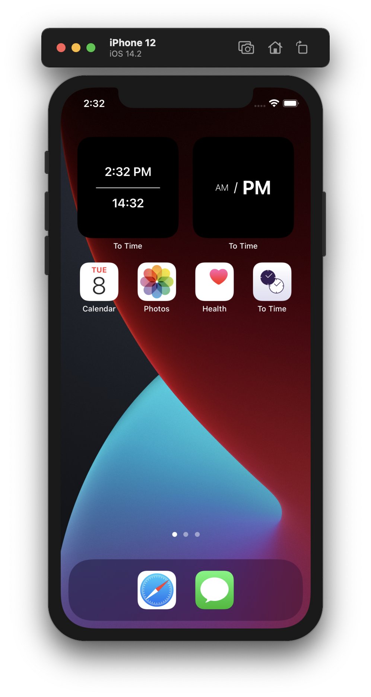

# To Time

The application shows the current time in 12-hour and 24-hour format.
It provides the possibility to set a specific time and convert it from 12-hour to 24-hour format and back.

# Requirements

* iOS 14.0

# Install

Application is available on [AppStore](https://apps.apple.com/us/app/to-time/id1542735776)

# Screenshots

 

# Licence

`To Time` is released under the BSD 3-Clause License. See [LICENSE](LICENSE) for details.
