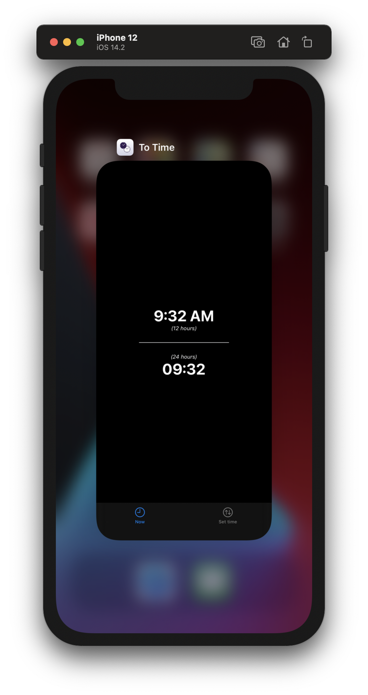
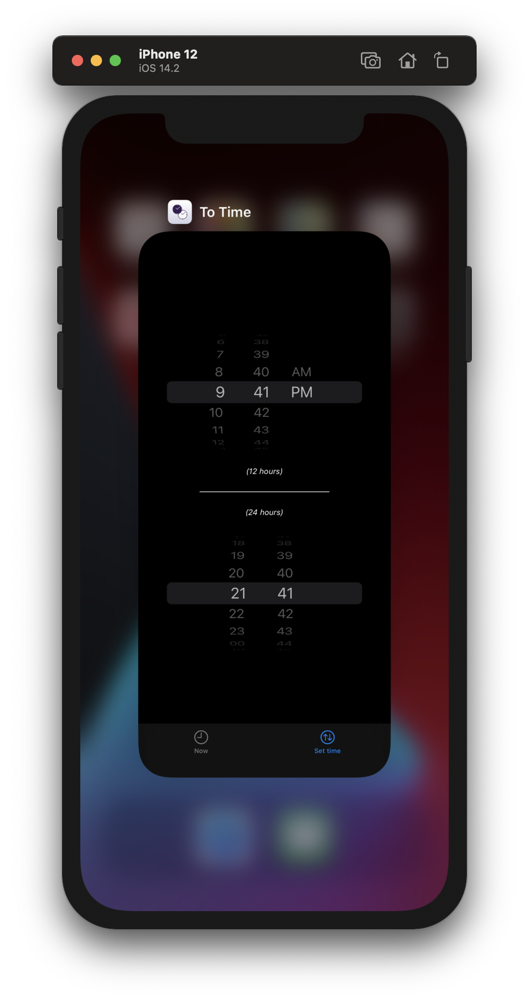

# To Time

iOS application, which shows current time both in 12-hour and 24-hour format. 
Application user has the possibility to set a specific time and convert it from 12-hours to 24-hours and back.

# Requirements

* iOS 14.0

# Install

Application is available on [AppStore](https://apps.apple.com/us/app/to-time/id1542735776)

# Screenshots

# Licence

`To Time` is released under the BSD 3-Clause License. See [LICENSE](LICENSE) for details.
